# Sử dụng Jenkins để quản lý quy trình CI/CD cho ứng dụng microservices 
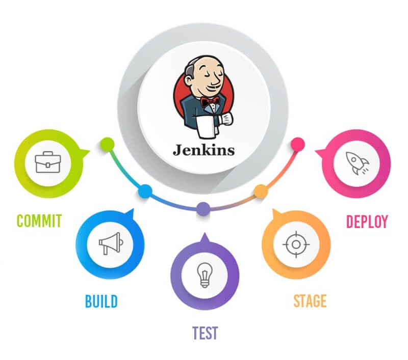

## 1. Cài đặt các công cụ cần thiết: 
1. [**Docker**](https://www.docker.com/): triển khai và chạy các ứng dụng trong các container.
2. [**Kubectl**](https://kubernetes.io/docs/tasks/tools/): tương tác với Kubernetes cluster.
3. [**Minikube**](https://minikube.sigs.k8s.io/docs/): triển khai Kubernetes cluster cục bộ, giúp quản lý các container, đảm bảo việc triển khai, mở rộng, và duy trì các service của ứng dụng microservices một cách tự động và hiệu quả.
4. [**Jenkin**](https://www.jenkins.io/doc/book/installing/): tự động hóa quá trình build, test và deploy ứng dụng microservices lên Docker, Kubernetes.

    | **Cài đặt các Plugin cần thiết**               |
    |------------------------------------------------|
    | Plugin Docker Pipeline                         |
    | Kubernetes Plugin                              |
    | Git Plugin                                     |
    | Plugin SonarQube Scanner                       |

5. [**SonarQube**](https://viblo.asia/p/cai-dat-cau-hinh-sonarqube-theo-script-tich-hop-va-tao-webhook-sonarqube-job-tren-jenkins-zOQJwY8NVMP): kiểm tra chất lượng mã nguồn.
6. [**Trivy**](https://trivy.dev/v0.18.3/installation/):quét bảo mật mã nguồn mở, phát hiện các lỗ hổng bảo mật trong mã nguồn, container images.

## 2.Tích hợp triển khai SonarQube trên Jenkins
-	Cài đặt Plugin SonarQube Scanner trên Jenkins

    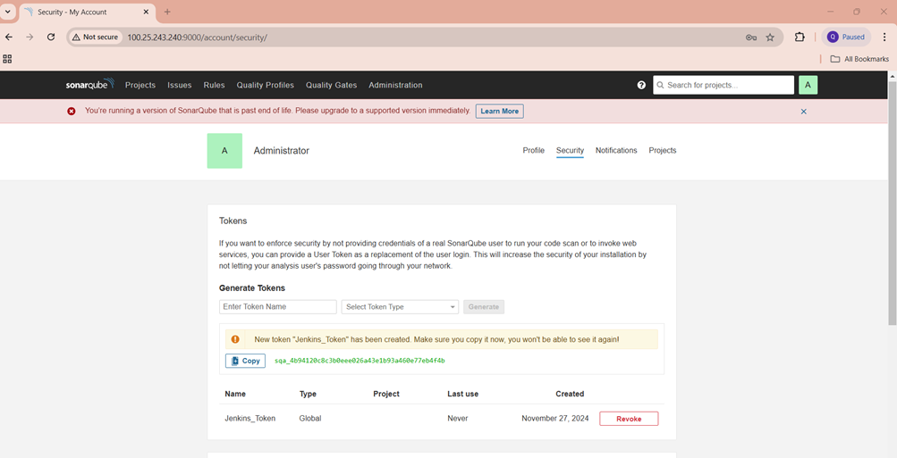

-	Vào SonarQube tạo token đăng nhập cho Jenkins

    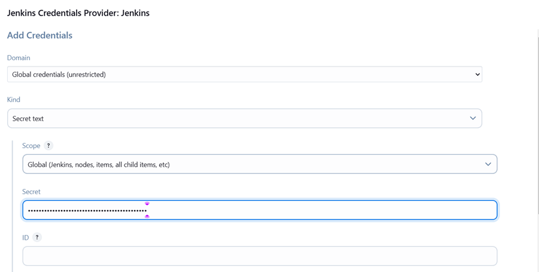

-	Cấu hình SonarQube server trên Jenkins: 
    -   Vào phần Manage Jenkins => System --> Add Credentials (Thêm token đã tạo ở trên) --> Thêm vào trường Name, URL server và authencation token như dưới hình:

    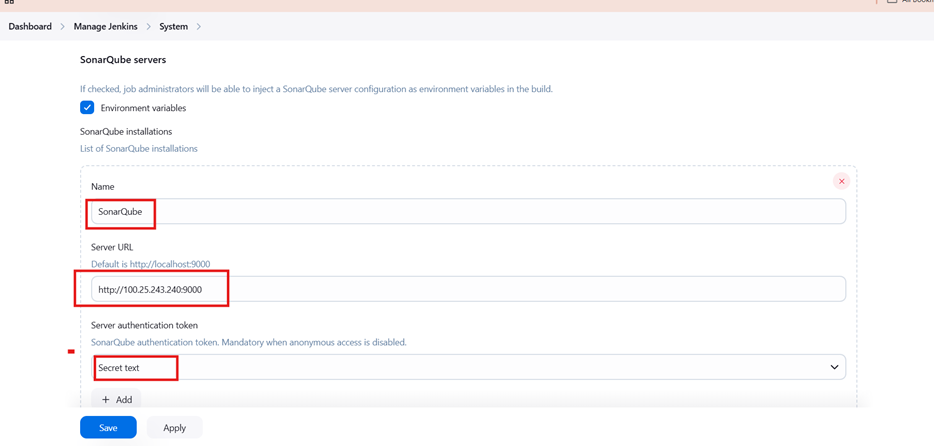

-	Vào  sonarqube tạo project: sẽ được sử dụng ở pipeline

    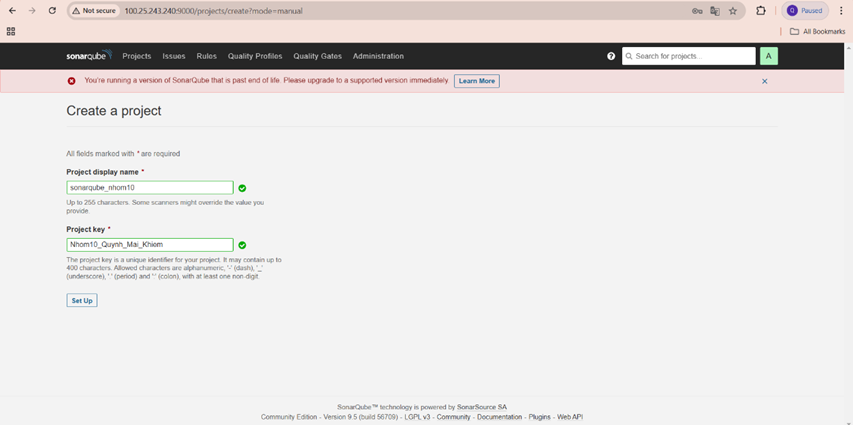

## 3.Tạo kết nối Jenkins truy cập được Minikube cluster
-	Điều chỉnh file : nano ~/.kube/config (lưu trữ thông tin cần thiết để kết nối với cụm Kubernetes). Thay đổi đường dẫn các file certificate thành nội dung mã hóa của file ( làm vậy để tránh khi Jenkins truy cập vào Minikube cluster gặp lỗi Permission Denied):

    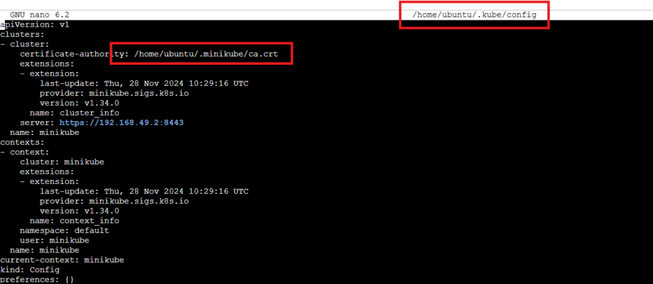
    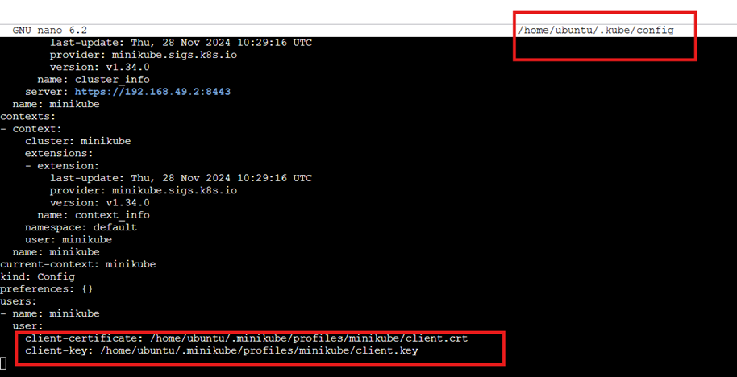

Lấy các giá trị này bằng cách lệnh sau: 

    cat /home/ubuntu/.minikube/ca.crt | base64 -w 0; echo
    cat /home/ubuntu/.minikube/profiles/minikube/client.crt | base64 -w 0; echo
    cat /home/ubuntu/.minikube/profiles/minikube/client.key | base64 -w 0; echo

- Thay thế đường dẫn các file thành nội dung mã hóa như sau: 

    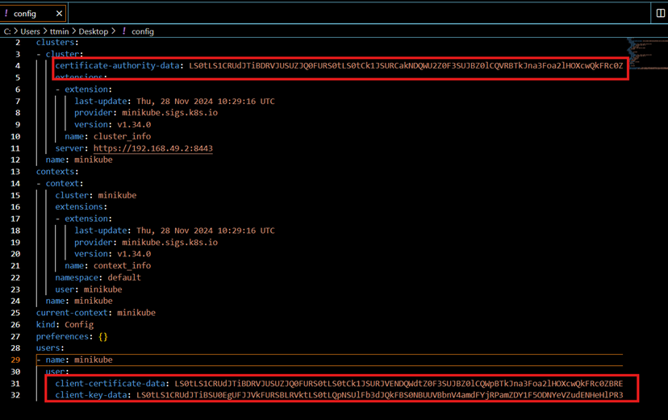

-	Manage Jenkins -> Clouds -> New cloud. Thêm file config ở trên vào Credentials. Test Connect và thấy đã thành công:  

    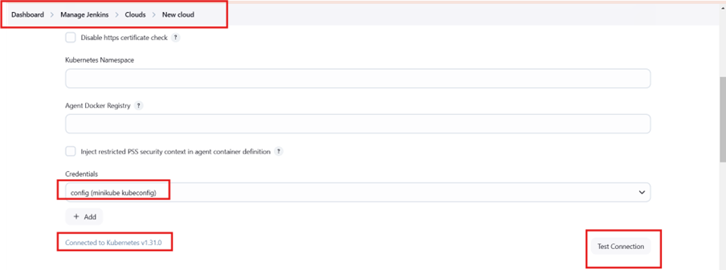

## 4.Tạo pipeline
Sử dụng Jenkins để tạo pipeline.
[Pipeline](Jenkins_file)  này được chia thành các bước chính sau đây, mỗi bước thực hiện một nhiệm vụ cụ thể trong quy trình CI/CD.

| **Pipeline**                                                      |
|-------------------------------------------------------------------|
| Clone mã nguồn từ GitHub                                          |
| Quét bảo mật mã nguồn bằng Trivy                                  |
| Phân tích chất lượng mã nguồn với SonarQube                       |
| Xây dựng image Docker bằng docker-compose                         |
| Quét bảo mật các image Docker bằng Trivy                          |
| Triển khai ứng dụng lên Kubernetes                                |
| Kiểm tra trạng thái triển khai                                    |
| Thông báo kết quả pipeline (hoàn thành, thành công hoặc thất bại) |

- Tạo pipeline: 

    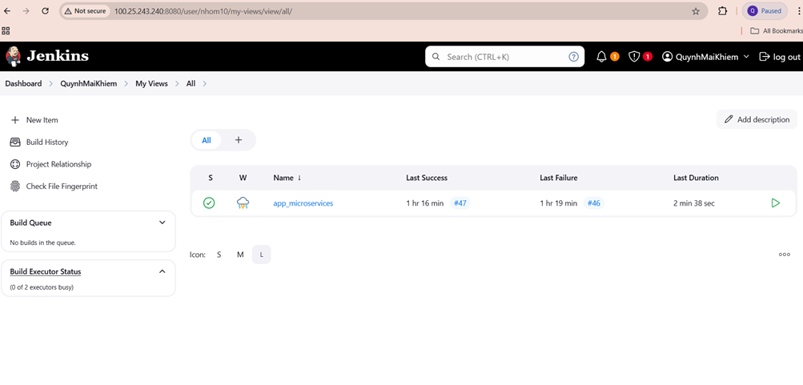

- Cấu hình pipeline script:

    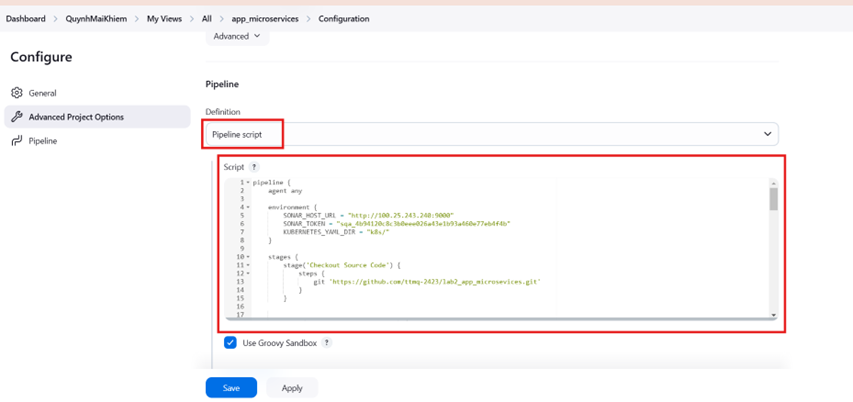

## 5. Kết quả chạy thành công pipeline: 
- Kết quả ở bước Verify Deployment:  

    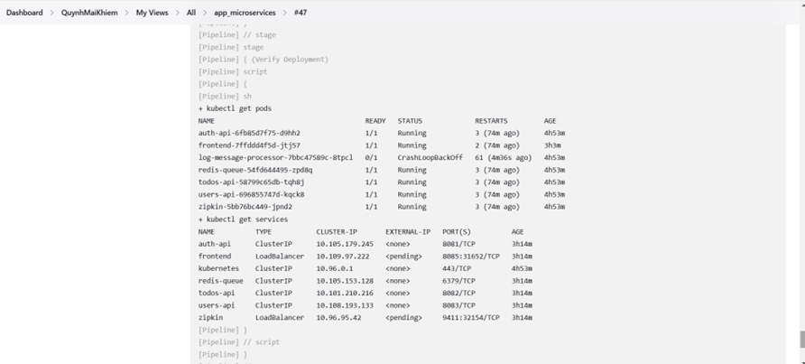

- State pipeline: 

    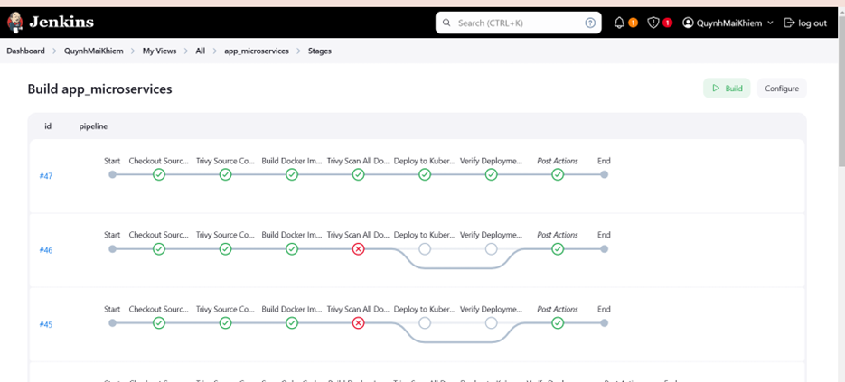

- Thử truy cập vào font-end của app microservices: 

    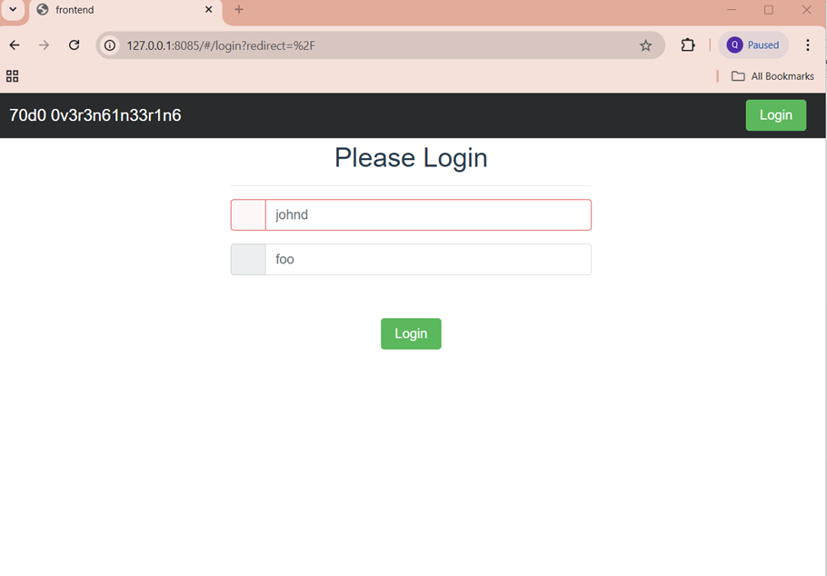

- Kiểm tra các file trivy report đã được tạo: 

    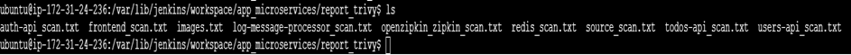
    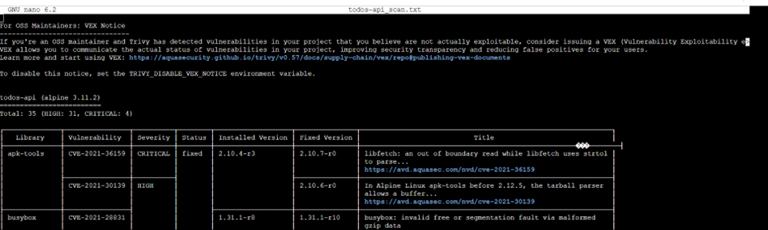

