# Using Jenkins to Manage CI/CD Pipelines for Microservices Applications
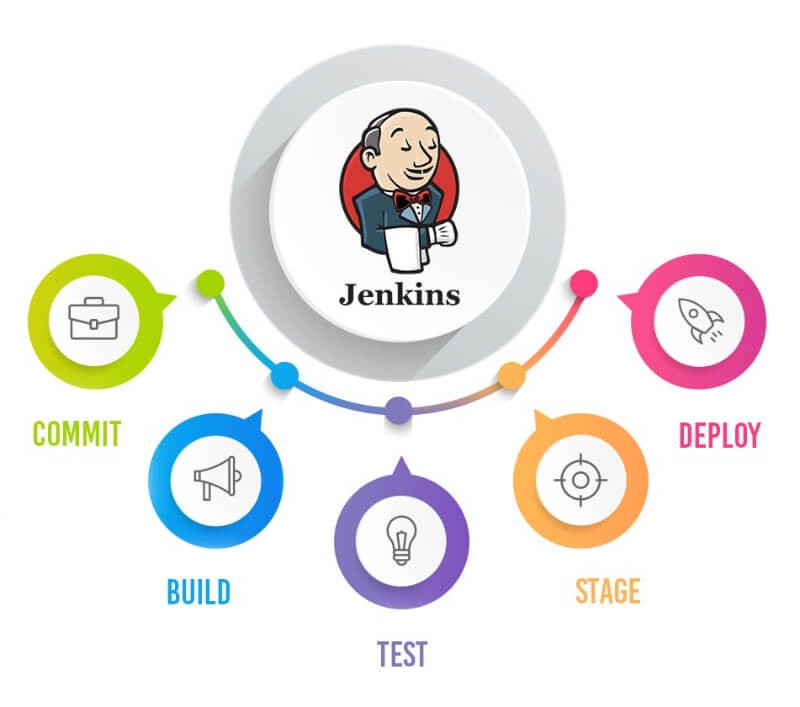

## 1. Install the necessary tools:
1. [**Docker**](https://www.docker.com/): Deploy and run applications in containers.
2. [**Kubectl**](https://kubernetes.io/docs/tasks/tools/): interact with Kubernetes clusters.
3. [**Minikube**](https://minikube.sigs.k8s.io/docs/): Deploy a local Kubernetes cluster, help manage containers, ensure the deployment, scaling, and maintenance of microservices applications automatically and efficiently.
4. [**Jenkin**](https://www.jenkins.io/doc/book/installing/): Automate the process of building, testing and deploying microservices applications to Docker, Kubernetes.

    | **Cài đặt các Plugin cần thiết**               |
    |------------------------------------------------|
    | Plugin Docker Pipeline                         |
    | Kubernetes Plugin                              |
    | Git Plugin                                     |
    | Plugin SonarQube Scanner                       |

5. [**SonarQube**](https://viblo.asia/p/cai-dat-cau-hinh-sonarqube-theo-script-tich-hop-va-tao-webhook-sonarqube-job-tren-jenkins-zOQJwY8NVMP): source code quality check
6. [**Trivy**](https://trivy.dev/v0.18.3/installation/): Open source security scanning, detecting security vulnerabilities in source code, container images. 

## 2.SonarQube Deployment Integration on Jenkins
-	Install SonarQube Scanner Plugin on Jenkins

    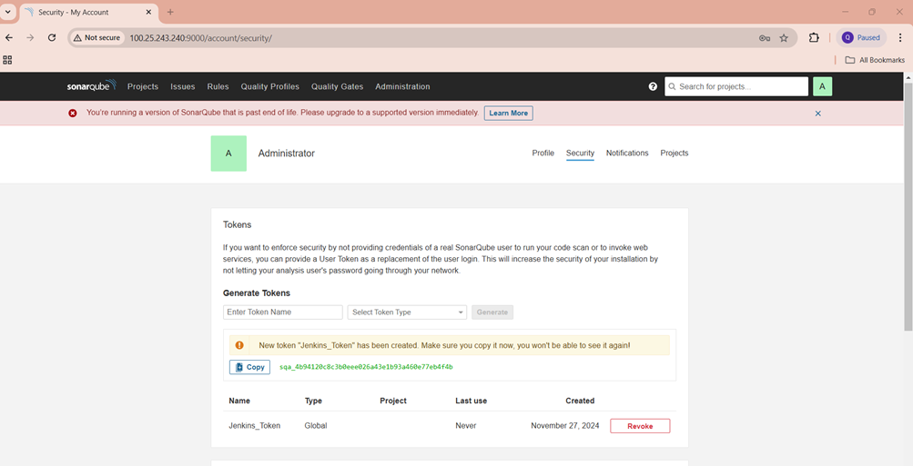

-	Go to SonarQube to create a login token for Jenkins

    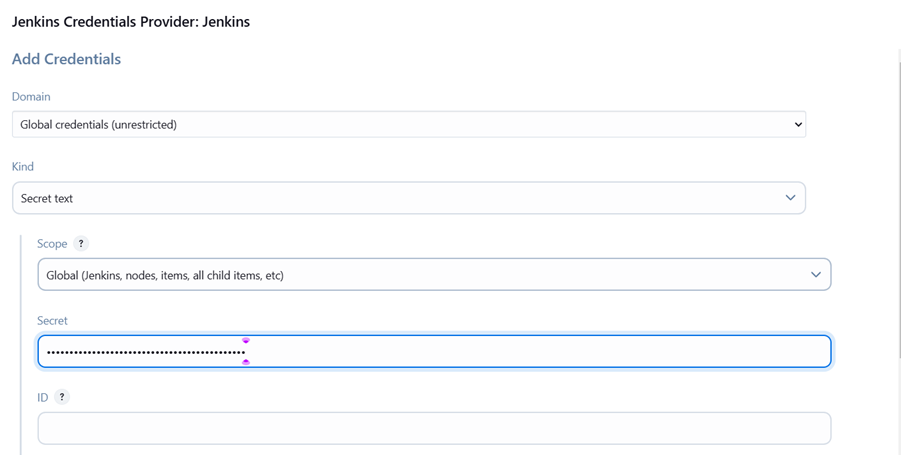

-	Configure SonarQube server on Jenkins: 
    -   Vào phần Manage Jenkins => System --> Add Credentials (Thêm token đã tạo ở trên) --> Thêm vào trường Name, URL server và authencation token như dưới hình:

    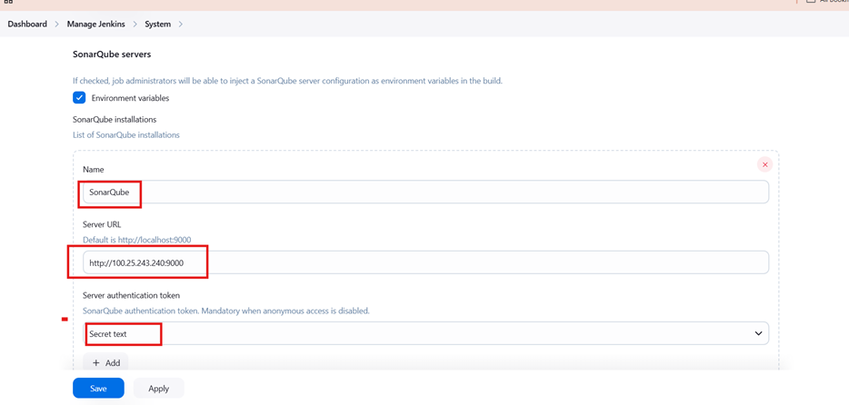

-	Go to sonarqube to create project: will be used in pipeline

    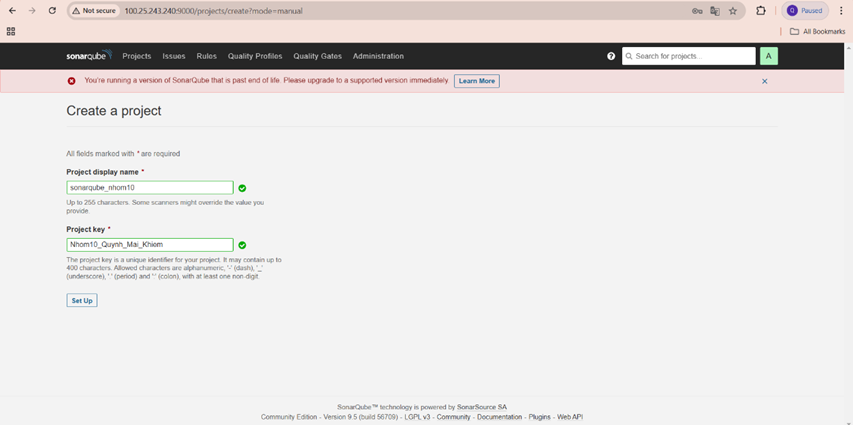

## 3.Create Jenkins connection to access Minikube cluster
-	Edit the file: nano ~/.kube/config (stores the information needed to connect to the Kubernetes cluster). Change the path of the certificate files to the encrypted content of the file (do this to avoid the Permission Denied error when Jenkins accesses the Minikube cluster):

    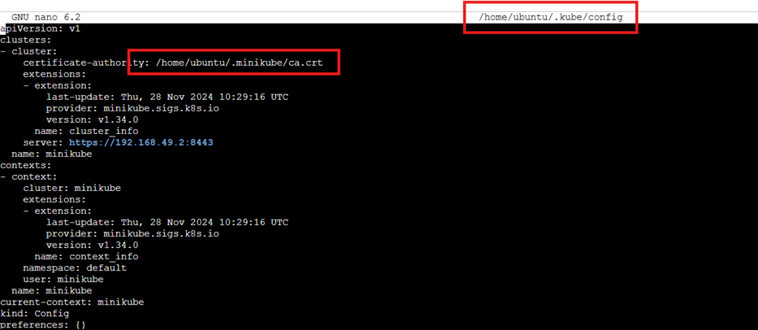
    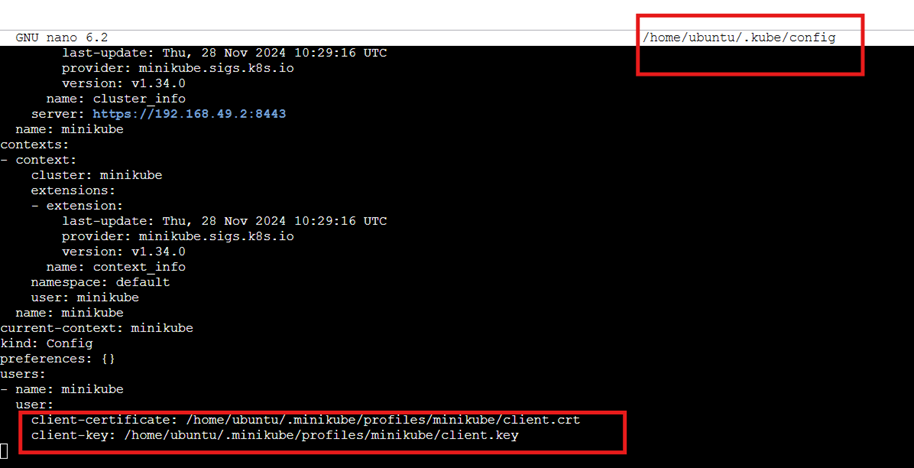

Get these values ​​using the following command:

    cat /home/ubuntu/.minikube/ca.crt | base64 -w 0; echo
    cat /home/ubuntu/.minikube/profiles/minikube/client.crt | base64 -w 0; echo
    cat /home/ubuntu/.minikube/profiles/minikube/client.key | base64 -w 0; echo

- Replace the file paths with the following encrypted content:

    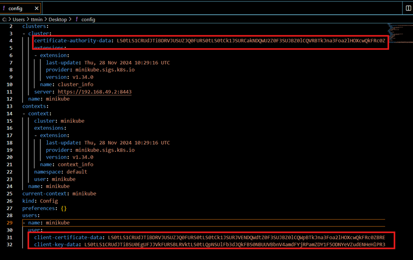

- Manage Jenkins -> Clouds -> New cloud. Add the above config file to Credentials. Test Connect and see if it works:

    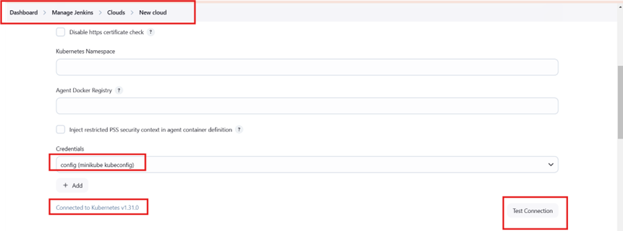

## 4. Create pipeline
Use Jenkins to create pipeline.
[Pipeline](Jenkins_file)  This is divided into the following main steps, each of which performs a specific task in the CI/CD pipeline.

| **Pipeline**                                                      |
|-------------------------------------------------------------------|
| Clone source code from GitHub                                     |
| Source Code Security Scanning with Trivy                          |
| Source Code Quality Analysis with SonarQube                       |
| Build Docker images using docker-compose                          |
| Security Scanning of Docker Images with Trivy                     |
| Deploy applications to Kubernetes                                 |
| Check deployment status                                           |
| Report pipeline results (complete, success or failure)            |

- Create pipeline:

    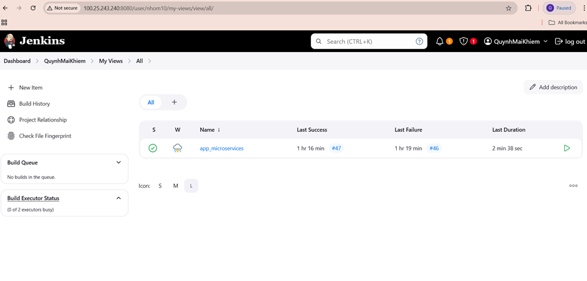

- Configure pipeline script:

    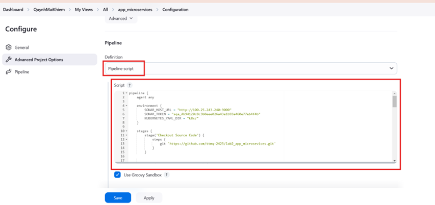

## 5. Successful pipeline run result:
- Results in Verify Deployment step:

    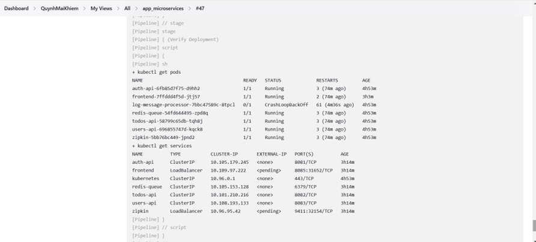

- State pipeline: 

    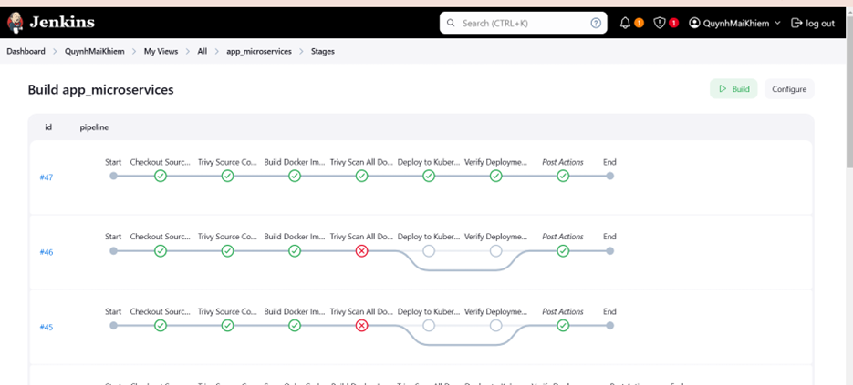

- Try accessing the front-end of the microservices app:

    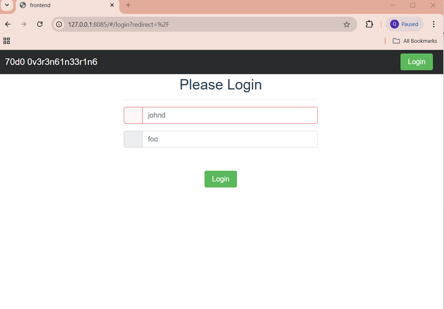

- Check the generated trivy report files:

    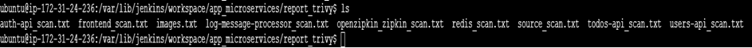
    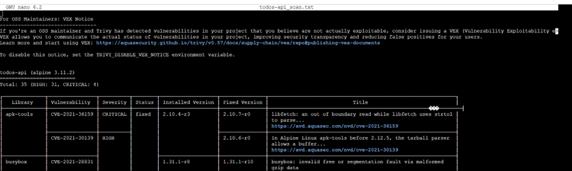

